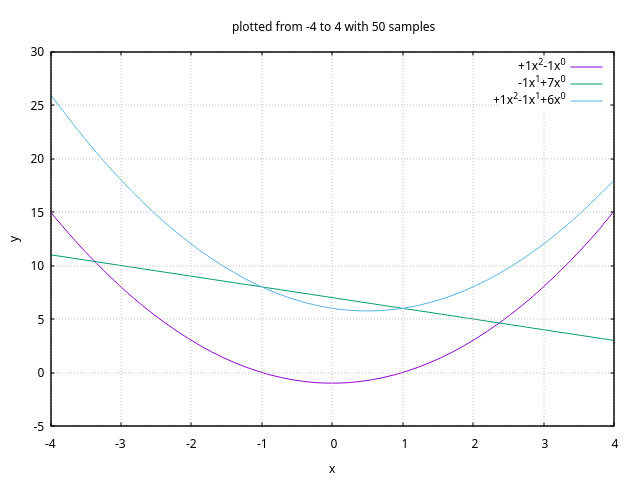
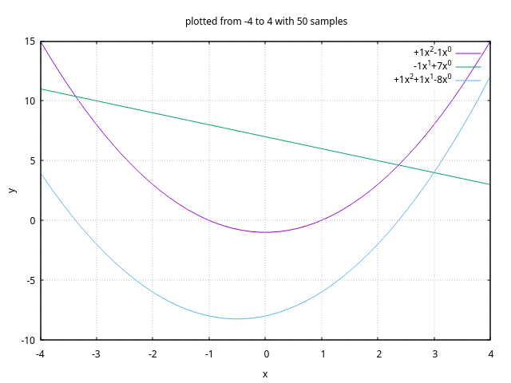
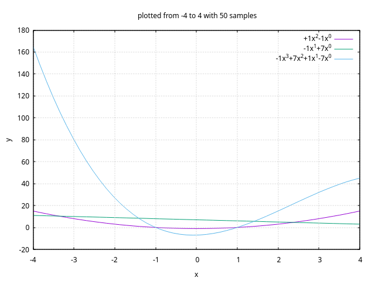
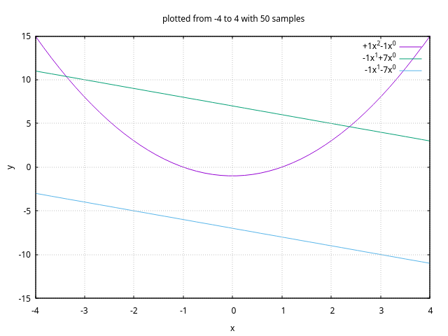
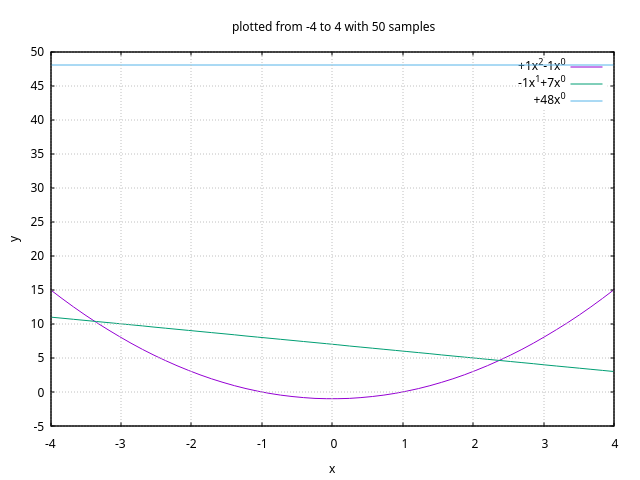
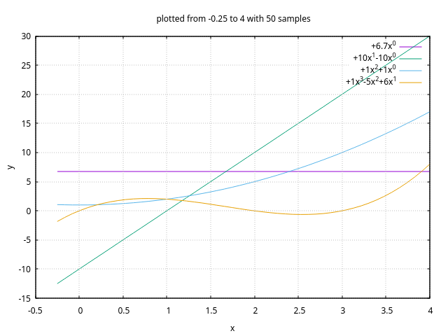

# polynomial

## description
- A simple implementation of a [polynomial](https://en.wikipedia.org/wiki/Polynomial).
- Rust port of my first ever coding project. (Was written in C++. Boy what a mess that was!)

## roadmap
- For arbitrary polynomials.
    - [x] "no zero-coeff terms in memory" invariant.
    - [x] latex compatible print.
    - [x] `+`, `-`, `*`, `/`, `%` operators.
    - [x] value at.
    - [x] derivative, integral.
    - [x] finding all real roots.
    - [x] plotting multiple polynomials in a finite range.
    - [ ] better root finding (using descartes rule, variable dx ...).

## code
- The code is written in stable `rust`.
- `gnuplot` is used for plotting.

## documentation
- The documentation for the code is itself.
- There is minimal documentation for some items, use `cargo doc --open` to view it.

## usage
- The polynomial implementation is provided as a library.
- The usage is illustrated in examples under `examples/` directory.
- To run an example use `cargo run --example <example-name-without-rs-extension>`.
- Get it in your crate using `Cargo.toml` dependency entry `polynomial = { git = "https://github.com/buggedbit/polynomial" }`.

## demonstration
Arithmetic operations on polynomials are illustrated below.

- Addition

- Subtraction

- Multiplication

- Division

- Remainder

Plotting arbitrary number of polynomials in a window.

